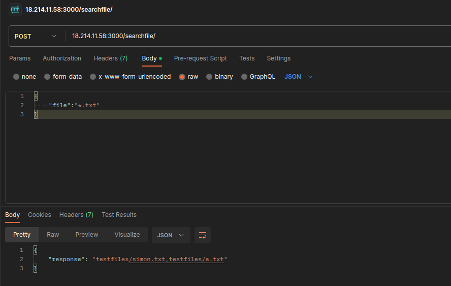

# info de la materia: ST0263 Temas especiales en telemática
#
# Estudiante(s): Simon Gomez Arango, sgomeza13@eafit.edu.co
#
# Profesor: Edwin Nelson Montoya Múnera, emontoya@eafit.edu.co
#

# Procesos comunicantes por API REST, RPC y MOM
#
# 1. breve descripción de la actividad
#
<texto descriptivo>

## 1.1. Que aspectos cumplió o desarrolló de la actividad propuesta por el profesor (requerimientos funcionales y no funcionales)
Se cumplió la funcionalidad de apigateway, a traves de una app de express se toman las peticiones por api REST. Se cumplió la funcionalidad tanto de buscar archivos como la de listarlos (incluyendo wildcards) todos, se cumplió la funcionalidad del primer microservicio conectado a traves de gRPC, se cumplió la funcionalidad de que cuando el gRPC este caido, se mande la peticion a una cola, se cumplió que las peticiones de la cola las lea el microservicio 2. Se cumplió que este desplegado en aws con una ip elastica

## 1.2. Que aspectos NO cumplió o desarrolló de la actividad propuesta por el profesor (requerimientos funcionales y no funcionales)
No se cumplió que el microservicio 2 devuelva la respuesta a las peticiones entrantes, solo las lee e imprime.

# 2. información general de diseño de alto nivel, arquitectura, patrones, mejores prácticas utilizadas.
- La arquitectura es basada en microservicios los cuales se comunican entre si mediante grpc y colas.
- En la comunicacion por grpc se utilizan callbacks para atrapar posibles errores.
- En la comunicacion por colas se utilizan funciones asincronas


# 3. Descripción del ambiente de desarrollo y técnico: lenguaje de programación, librerias, paquetes, etc, con sus numeros de versiones.
La principal tecnologia usada fue JavaScript, para el API REST se creo una aplicacion de express, y para la comunicacion con los microservicios gRPC y Rabbitmq. Tambien se utilizo la libreria de dotenv para gestionar las variables de entorno en las cuales se configura ip, puertos, rutas, etc. Se emplearon tambien las librerias de glob y fs para hacer la busqueda al filesystem.

## como se compila y ejecuta.
Primero verificar que esta corriendo rabbitmq en la imagen de docker, si no esta corriendo inicializar:
```
docker start rabbit-server
```
Luego ir a la carpeta de repositorio
```
cd topicos_telematica-reto2
```
Luego en tres consolas diferentes inicializar el apigateway y los dos microservicios
```
cd ApiGateway
npm start
```
```
cd microservicio1
npm start
```
```
cd microservicio2
npm start
```
## detalles técnicos
Para el rabbitmq no se utiliza ningun tipo de exchange, solo la cola
El grpc se implemento mediante callbacks
## descripción y como se configura los parámetros del proyecto (ej: ip, puertos, conexión a bases de datos, variables de ambiente, parámetros, etc)
La aplicacion de express corre en el puerto 3000, el de grpc en el puerto 8000 y rabbitmq por los puertos por defecto(5672 y 15672)

## opcional - detalles de la organización del código por carpetas o descripción de algún archivo. (ESTRUCTURA DE DIRECTORIOS Y ARCHIVOS IMPORTANTE DEL PROYECTO, comando 'tree' de linux)
Cada servicio esta separado en carpetas idependientes, cada uno tiene sus propias dependencias y variables de entorno


## 
## opcionalmente - si quiere mostrar resultados o pantallazos 
**listfiles grpc**

**searchfiles grpc**



**rabbitmq**


# IP o nombres de dominio en nube o en la máquina servidor.

18.214.11.58 (elastica)

## una mini guia de como un usuario utilizaría el software o la aplicación
A partir de un cliente como postman o thunder client se pueden hacer dos requests:
1. para listar archivos se debe ingresar la siguiente ruta mediante un GET: 18.214.11.58:3000/listfiles/
**NOTA: Debe obligatoriamente ser por el puerto 3000**
2. para buscar archivos debe ingresar a la siguiente ruta mediante un POST: 18.214.11.58:3000/searchfile/
Y su body debe ser un JSON de la siguiente forma:
{
    "file":"nombre_del_archivo.ejemplo"
}


# referencias:
<debemos siempre reconocer los créditos de partes del código que reutilizaremos, así como referencias a youtube, o referencias bibliográficas utilizadas para desarrollar el proyecto o la actividad>
## https://grpc.io/docs/languages/node/
## https://www.rabbitmq.com/getstarted.html
## https://sharmilas.medium.com/get-started-with-rabbitmq-in-node-js-1adb18d019d0

#### versión README.md -> 1.0 (2023-agosto)